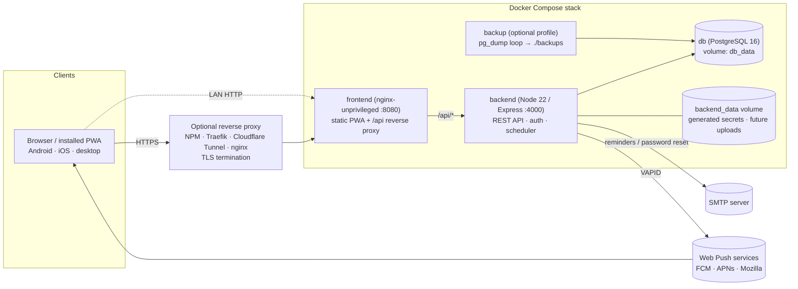

# Architecture

## 1. System overview



**Single public entry point.** Only the frontend container publishes a port. nginx serves the built PWA and proxies `/api/*` to the backend over the private Compose network. The browser therefore sees one origin, which removes CORS, allows `SameSite=Strict` cookies, and gives a reverse proxy exactly one upstream to point at.

**Backend responsibilities**

| Layer | Location | Notes |
|---|---|---|
| Config & startup validation | `backend/src/config/env.ts` | zod schema over all env vars; fails fast with readable errors; builds `DATABASE_URL` from `POSTGRES_*` (URL-encodes the password); generates and persists `JWT_SECRET` if unset |
| HTTP | `backend/src/app.ts` | helmet, pino-http request logs with request IDs, JSON body limit, `trust proxy`, rate limiting, `/api/v1` versioned routes |
| Modules | `backend/src/modules/*` | auth, users/settings, categories, bills, bill-occurrences, events, event-occurrences, calendar, dashboard, notifications/push, audit, health |
| Domain services | `backend/src/services/*` | occurrence generation/reconciliation, reminders, auto-pay, audit, scheduler |
| Shared rules | `packages/core` (`@skr/core`) | recurrence expansion, timezone math, scheduling/reconcile decisions, overdue status, money totals, reminder selection and text, validation schemas, API types. The same code runs in the server, the web app and (next) the Android app. |
| Server libraries | `backend/src/lib/*` | tokens, mail, push, prisma, logger, errors, schema re-exports |
| Persistence | Prisma 6 → PostgreSQL | migrations in `backend/prisma/migrations`, applied on container start |

**Background scheduler** (in-process, `services/scheduler.ts`):

| Job | Interval | Purpose |
|---|---|---|
| reminders | 1 min | plan due reminders (idempotent inserts) and deliver them in-app, by email or by push |
| autopay | 5 min | complete AUTOPAY / SCHEDULED_AUTOPAY occurrences once their pay instant passes (user opt-in) |
| horizon | 6 h | extend recurring series so occurrences always exist `OCCURRENCE_HORIZON_DAYS` ahead |
| prune | 24 h | delete delivered notifications older than 180 days |

Every job is idempotent: unique keys, conditional `updateMany`, and row claiming. Running two API replicas by accident therefore cannot double-complete a bill or double-send a reminder.

### The occurrence model (core requirement)

```
Bill (template)  1 ──── *  BillOccurrence (one row per due date)
Event (template) 1 ──── *  EventOccurrence (one row per date)
```

* A template stores the schedule (`startDate`, recurrence fields mapping 1:1 to RFC 5545 RRULE, reminder offsets).
* Occurrences are materialised rows with **their own** `status`, `completedAt`, `amountPaid`, `confirmationNumber`, `notes` and `isModified`.
* **Every status change is a single-row update by primary key**, scoped to the owner, inside a transaction that also writes an `AuditLog` row for that occurrence. No code path updates occurrences in bulk by template, except system reconciliation, which only touches *untouched* rows (below).
* **Template edits** reconcile only occurrences that are PENDING/UPCOMING, never individually edited, and not in the past. Matching slots are updated in place, so ids and reminders survive. Slots no longer in the schedule are removed and new ones inserted. Completed, skipped, cancelled, edited and past occurrences are **never** modified.
* `@@unique([billId, originalDueDate])` guarantees a slot is generated only once, even if the user moved that occurrence to another date.
* **OVERDUE** is derived at read time (PENDING and due date before *today in the user's timezone*), so it can never drift out of sync.

### Time zones

* Calendar days (due date, event date) are `DATE` columns holding the user's **local** day. A bill due "the 15th" stays on the 15th in any timezone.
* Instants (`dueAt`, `startAt`, `autopayAt`, reminders, audit timestamps) are `timestamptz` in UTC, derived from local date + time + user timezone with luxon, so DST is handled.
* When a user changes timezone (or the all-day reminder time), instants for all actionable occurrences are recomputed (`recomputeInstants`).

## 5. Authentication architecture

```mermaid
sequenceDiagram
  participant SPA
  participant API
  participant DB
  SPA->>API: POST /auth/login {email, password}
  API->>DB: bcrypt.compare (constant-time path for unknown emails)
  API-->>SPA: { accessToken (JWT, 15 min) }  + Set-Cookie skr_rt (httpOnly, SameSite=Strict, Path=/api/v1/auth) + skr_csrf
  SPA->>API: GET /bills  Authorization: Bearer <access>
  API->>DB: verify user active & tokenVersion matches
  Note over SPA: access token expires
  SPA->>API: POST /auth/refresh  X-CSRF-Token: <skr_csrf>  (cookie sent automatically)
  API->>DB: find session by SHA-256(token); revoke it; create successor in same family
  API-->>SPA: new access token + rotated cookies
```

| Concern | Implementation |
|---|---|
| Password hashing | bcrypt (`bcryptjs`, cost `BCRYPT_ROUNDS`, default 12). 8–72 byte passwords. |
| Access token | HS256 JWT with `iss`/`aud`, 15 min, kept **only in memory** (not localStorage), sent as a Bearer header. Includes `tokenVersion`; bumping it (password change, "sign out everywhere", admin disable) invalidates every token immediately because the user row is checked on each request. |
| Refresh token | 256-bit random opaque value; only its SHA-256 hash is stored (`sessions`). httpOnly, `SameSite=Strict`, `Secure` when `APP_URL` is https, path-scoped to `/api/v1/auth`. Rotated on every use. |
| Reuse detection | Each login starts a token *family*. Replaying an already-rotated token (older than a 60 s multi-tab grace window) revokes the whole family and is audited. |
| CSRF | Data endpoints use Bearer tokens, which cross-site requests cannot attach. The two cookie-authenticated endpoints (`/auth/refresh`, `/auth/logout`) require a double-submit `X-CSRF-Token` header matching the `skr_csrf` cookie. Cookies are `SameSite=Strict`. |
| Brute force | Per-IP rate limit on credential endpoints (`AUTH_RATE_LIMIT_MAX` per window) plus per-account lockout (10 failures → 15 min). |
| Password reset | One-time token (SHA-256 stored, 1 h, single use). Success revokes all sessions. Responses never reveal whether an email exists. Without SMTP, admins use the CLI. |
| Email verification | Optional (`REQUIRE_EMAIL_VERIFICATION=true` and SMTP configured), 48 h one-time token. |
| Authorization | Every query is scoped by `userId` from the verified token. Cross-user ids return 404 rather than 403, so existence is not leaked. |
| Transport & headers | helmet on the API; strict CSP, `X-Frame-Options: DENY`, `nosniff`, Referrer-Policy and Permissions-Policy from nginx. HSTS belongs on the TLS-terminating proxy. |

## 6. React component architecture

```
main.tsx
└─ PersistQueryClientProvider (TanStack Query, cache persisted for offline)
   └─ BrowserRouter
      └─ ToastProvider
         └─ AuthProvider (session: loading | authenticated | offline | anonymous)
            └─ RepositoryProvider (DataRepository: remote today, local on Android)
               └─ App (routes)
               ├─ Public: LoginPage · RegisterPage · ForgotPasswordPage · ResetPasswordPage · VerifyEmailPage
               └─ RequireAuth → AppLayout (sidebar · header [bell, quick-add] · bottom nav · offline banner · theme sync)
                  ├─ DashboardPage ── StatCard · BillOccurrenceRow · EventOccurrenceRow · *OccurrenceDialog
                  ├─ CalendarPage (lazy) ── FullCalendar (luxon tz plugin) · filter · add-on-date modal · dialogs
                  ├─ BillsPage ── tabs (upcoming/overdue/completed/all) · BillOccurrenceRow · BillOccurrenceDialog
                  ├─ BillDetailPage ── series summary · occurrences (upcoming/past) · HistoryList · ConfirmDialog
                  ├─ BillEditorPage ── BillForm ── RecurrenceEditor · ReminderEditor · CategorySelect
                  ├─ EventsPage / EventDetailPage / EventEditorPage (mirror of bills)
                  ├─ CategoriesPage ── CategoryColumn ×2 (bill / event)
                  ├─ NotificationsPage
                  └─ SettingsPage ── Profile · Region & time · Appearance · Reminders · Notifications (push) · Security · Data
```

* **Data layer:** screens never call HTTP directly. They use the React Query hooks in `src/api/hooks.ts`, which call a **`DataRepository`** (`src/data/repository.ts`) supplied by `<RepositoryProvider>`:
  * `RemoteRepository` (`src/data/remote.ts`) maps each method to exactly one REST call, and a contract test pins every request. The web app uses it.
  * `LocalRepository` (`src/data/local/engine.ts`) is the whole app engine on the device's own SQLite database (`schema.ts`), behaving like the server route for route and using the same `@skr/core` rules. It covers occurrence generation and reconciliation, per-occurrence history, auto-pay, the in-app reminder inbox, the dashboard and calendar, validation and export. Occurrence ids are deterministic (UUIDv5 of template + slot), so device and server agree on them. Every call is serialised and runs in one SQL transaction. It reaches SQLite through a tiny `SqlDriver` interface: `sql.js` (WebAssembly, with an IndexedDB snapshot) in browsers and tests, and native SQLite on Android (milestone 4). Changes are logged to an `outbox` table for the future sync.

  Server-only account features (sign-in, registration, password reset, email verification, sign out everywhere, account deletion, test notifications) live in `src/data/account.ts`, and push subscriptions in `src/lib/push.ts`, so a standalone install can hide them. `src/api/client.ts` is the fetch wrapper: in-memory access token, single-flight silent refresh on 401, and a 409 multi-tab retry. Mutations invalidate all dependent views (dashboard, calendar, lists, history).
* **Offline:** the service worker precaches the app shell. Query results are persisted to localStorage per user and wiped on sign-out or account switch. When the server is unreachable at startup, the app opens in read-only *offline* mode with the cached data and reconnects automatically.
* **UI kit:** Tailwind component classes (`btn-*`, `input`, `card`, `chip`) plus `Modal` (focus trap, Escape, bottom sheet on mobile), `ConfirmDialog`, `Toast`, `Segmented`, `Toggle`, `Field` (label/hint/error wiring).
* **Accessibility:** semantic landmarks, skip link, labelled controls, `role=dialog` with `aria-modal`, `role=switch` and `radiogroup`, visible focus rings, live regions for toasts, and colour never the only status signal (badges carry text).

## 7. Folder structure

```
.
├── docker-compose.yml          # db · backend · frontend · backup (profile)
├── .env.example
├── scripts/                    # backup.sh · restore.sh
├── package.json                # npm workspaces root
├── docs/                       # this documentation
├── .github/workflows/          # CI + image publishing
├── packages/
│   └── core/                   # @skr/core: shared business rules (server, web, Android)
│       ├── src/                # recurrence · time · schedule · status · money · reminders
│       │                       # schemas (zod) · types (API contracts) · format · defaults
│       └── tests/
├── backend/
│   ├── Dockerfile · docker-entrypoint.sh
│   ├── prisma/
│   │   ├── schema.prisma
│   │   └── migrations/<timestamp>_<name>/migration.sql
│   ├── src/
│   │   ├── index.ts            # bootstrap, graceful shutdown
│   │   ├── app.ts              # express app factory
│   │   ├── cli.ts              # admin CLI
│   │   ├── config/env.ts       # startup validation
│   │   ├── lib/                # tokens, validate (re-exports core schemas), mailer, push, prisma, logger, errors
│   │   ├── middleware/         # auth, csrf, rateLimit, errorHandler
│   │   ├── modules/<feature>/  # *.routes.ts (+ service where non-trivial)
│   │   ├── services/           # occurrence, reminder, autopay, scheduler, audit, settings, serializers
│   │   │                       # (DB operations; the rules they apply come from @skr/core)
│   │   └── scripts/database-url.ts
│   └── tests/                  # unit + API integration tests (vitest + supertest)
└── frontend/
    ├── Dockerfile · nginx/
    ├── public/                 # icons, favicon, theme-init.js
    └── src/
        ├── main.tsx · App.tsx · sw.ts · queryClient.ts · index.css
        ├── api/                # HTTP client + React Query hooks (types come from @skr/core)
        ├── data/               # DataRepository interface, RemoteRepository, account (server-only), provider
        │   └── local/          # standalone engine: schema, SqlDriver, sql.js driver, LocalRepository
        ├── auth/AuthProvider.tsx
        ├── hooks/              # settings/theme/online, canEdit
        ├── lib/                # push
        ├── components/{ui,layout,shared,bills,events}/
        └── pages/              # one file per route (+ auth/)
```

## 8. Docker architecture

| Container | Image | User | Port | Health check | Persistence |
|---|---|---|---|---|---|
| `db` | `postgres:16-alpine` | postgres | internal 5432 | `pg_isready` | `db_data` → `/var/lib/postgresql/data` |
| `backend` | built from `backend/Dockerfile` (node:22-alpine, multi-stage) | `node` (1000) | internal 4000 | `GET /api/health/ready` (checks DB) | `backend_data` → `/app/data` |
| `frontend` | built from `frontend/Dockerfile` (nginx-unprivileged) | `nginx` (101) | **8080 published** | `GET /healthz` | none (stateless) |
| `backup` *(profile)* | `postgres:16-alpine` | root | none | — | `./backups` bind mount |

Hardening: `no-new-privileges`; `cap_drop: ALL` on app containers; backend runs with a **read-only root filesystem** (tmpfs `/tmp`); `init: true` (tini) for signal handling; json-file log rotation; startup ordering via `depends_on: condition: service_healthy`. The backend entrypoint applies migrations before starting (`RUN_MIGRATIONS=true`).

nginx re-resolves the backend's DNS name every 10 s using the container's own resolver (`NGINX_ENTRYPOINT_LOCAL_RESOLVERS`, which works on Docker and Podman), so recreating the backend never leaves the frontend pointing at a stale IP.

### Designed for future growth

| Future feature | Hook already in place |
|---|---|
| SMS notifications | `NotificationChannel.SMS` enum value and per-channel delivery switch in `reminder.service.ts` |
| Email / push | Implemented: SMTP via nodemailer, Web Push via VAPID |
| Mobile app | Versioned REST API (`/api/v1`), Bearer tokens, refresh flow usable by native clients |
| Shared calendars / family accounts | Occurrences carry `userId` and every query is owner-scoped in one place per module, so adding a `CalendarMember` ACL table changes only the scoping predicate |
| Google / Outlook sync | Recurrence fields map 1:1 to RFC 5545 (the API already returns `rrule`); stable occurrence ids and `originalDueDate` support external ids and exception dates |
| File uploads (receipts) | `backend_data` volume mounted at `/app/data` |
