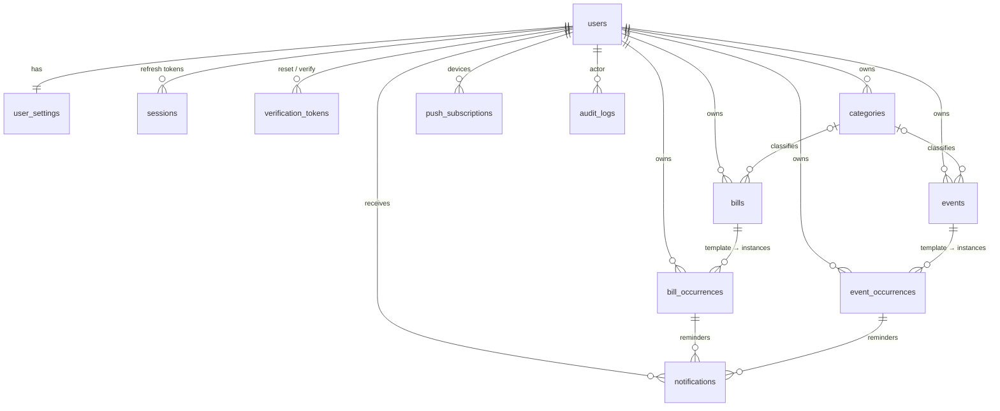

# Database

PostgreSQL 16, managed with Prisma. The authoritative definition is [`backend/prisma/schema.prisma`](../backend/prisma/schema.prisma). The SQL that creates it is in [`backend/prisma/migrations`](../backend/prisma/migrations).

## Entity relationships



## Tables

### `users`
| Column | Type | Notes |
|---|---|---|
| id | uuid PK | |
| email | text unique | stored lower-cased |
| password_hash | text | bcrypt |
| display_name | text | |
| role | enum `ADMIN` / `USER` | first account is ADMIN |
| is_active | bool | disabled users cannot sign in |
| email_verified_at | timestamptz? | |
| token_version | int | incremented to revoke all access tokens |
| failed_login_count, locked_until | int, timestamptz? | lockout |
| last_login_at, created_at, updated_at | timestamptz | |

### `user_settings` (1:1 with users)
`timezone` (IANA), `theme` (SYSTEM/LIGHT/DARK), `week_starts_on`, `currency`, `locale`, `time_format`, `default_calendar_view`, `default_bill_reminders int[]`, `default_event_reminders int[]`, `all_day_reminder_time` (HH:mm), `auto_complete_autopay`, `in_app_notifications`, `email_notifications`, `push_notifications`.

### `sessions`
Refresh-token sessions: `token_hash` (SHA-256, unique), `family_id` (rotation chain), `user_agent`, `ip_address`, `expires_at`, `revoked_at`, `last_used_at`.

### `verification_tokens`
One-time tokens for `PASSWORD_RESET` / `EMAIL_VERIFICATION`: `token_hash` unique, `expires_at`, `used_at`.

### `categories`
`user_id`, `name`, `type` (BILL / EVENT), `color` (#hex), `icon`, `sort_order`. Unique on `(user_id, type, name)`. Deleting a category sets `category_id = NULL` on its bills and events and never deletes them.

### `bills` — bill templates
| Column | Type | Notes |
|---|---|---|
| id, user_id, category_id? | uuid | |
| name, description?, notes? | text | |
| amount | numeric(12,2) | CHECK ≥ 0 |
| payment_method | enum MANUAL / AUTOPAY / SCHEDULED_AUTOPAY | |
| scheduled_pay_days_before | int? | for scheduled auto-pay |
| start_date | date | first (or only) due date, a local calendar day |
| due_time | text? | HH:mm local; null = all-day |
| recurrence_frequency | enum DAILY / WEEKLY / MONTHLY / YEARLY ? | null = one-time |
| recurrence_interval | int ≥ 1 | "custom interval" (every N units) |
| recurrence_by_weekday | int[] | weekly only, 0 = Sunday |
| recurrence_end_date | date? | inclusive |
| recurrence_count | int? | total occurrences |
| reminder_offsets | int[] | minutes before due |
| generated_until | date? | materialisation watermark |
| is_archived | bool | series ended; history kept |
| created_at, updated_at | timestamptz | |

### `bill_occurrences` — one row per due date
| Column | Type | Notes |
|---|---|---|
| id | uuid PK | |
| bill_id | uuid FK → bills (cascade) | |
| user_id | uuid FK → users | denormalised for isolation and indexing |
| original_due_date | date | schedule slot; **unique with bill_id** |
| due_date | date | effective (may be moved by the user) |
| due_time | text? | |
| due_at | timestamptz | UTC instant used for reminders |
| amount | numeric(12,2) | snapshot; editable per occurrence |
| status | enum PENDING / COMPLETED / SKIPPED | OVERDUE is derived |
| completed_at | timestamptz? | CHECK: required when COMPLETED |
| amount_paid | numeric(12,2)? | |
| confirmation_number, notes | text? | |
| scheduled_pay_date | date? | auto-pay execution day |
| autopay_at | timestamptz? | auto-pay execution instant |
| is_modified | bool | user-edited; template edits never overwrite it |
| created_at, updated_at | timestamptz | |

Indexes: `(user_id, due_date)`, `(user_id, status, due_date)`, `(status, due_at)`, `(status, autopay_at)`.

### `events` / `event_occurrences`
These mirror bills. Event templates have `title`, `description`, `notes`, `location`, `start_date`, `start_time?`, `end_time?`, recurrence fields and `reminder_offsets`, and **no money fields**. Occurrences have `original_date` (unique with event_id), `event_date`, `start_time`, `end_time`, `start_at`, `end_at`, `status` (UPCOMING / COMPLETED / CANCELLED), `completed_at`, `cancelled_at`, `notes` and `is_modified`.

### `notifications`
One delivery of one reminder: `user_id`, `channel` (IN_APP / EMAIL / PUSH / SMS), `status` (PENDING / SENT / FAILED / CANCELLED), `bill_occurrence_id?` or `event_occurrence_id?` (CHECK: not both), `offset_minutes`, `scheduled_for`, `title`, `body`, `url`, `attempts`, `last_error`, `sent_at`, `read_at`. **Unique on `(occurrence, offset, channel)`**, which makes reminder planning idempotent.

### `push_subscriptions`
Web Push endpoints per device: `endpoint` unique, `p256dh`, `auth`, `user_agent`.

### `audit_logs`
Append-only: `user_id`, `actor_type` (USER / SYSTEM), `entity_type` (BILL, BILL_OCCURRENCE, EVENT, EVENT_OCCURRENCE, CATEGORY, SETTINGS, USER, SESSION), `entity_id`, `action` (CREATED, UPDATED, COMPLETED, SKIPPED, CANCELLED, REOPENED, AUTOPAY_COMPLETED, ARCHIVED, DELETED, LOGIN, …), `changes` (JSON field diff), `metadata` (IP, user agent), `created_at`. There is deliberately **no FK to the audited entity**, so history survives deletion.

### Sync tables (Android app)
* Every synced table (`user_settings`, `categories`, `bills`, `bill_occurrences`, `events`, `event_occurrences`, `audit_logs`) has `sync_xid BIGINT`, set by the `skr_stamp_sync_xid` trigger to the writing transaction's id on every insert/update.
* `sync_tombstones`: `user_id`, `entity_type`, `entity_id`, `sync_xid`, `deleted_at`, written by the `skr_record_tombstone` AFTER DELETE trigger (also for cascaded deletes). Purged after 180 days.
* `bill_occurrences.status_changed_at` / `event_occurrences.status_changed_at`: when the status last changed (complete / skip / cancel / reopen / auto-pay). Sync decides status conflicts by it.
* `devices`: phones signed in through `/auth/native/login` (`session_family_id` links to their refresh sessions; `revoked_at` on sign-out).
* `sync_batches`: the answer to each processed push (`id` = the device's batch id), so a retried batch isn't applied twice. Purged after 14 days.
* New occurrence ids are deterministic (`UUIDv5(templateId + originalDate)`, `@skr/core` `occurrenceId`), so the server and phones create the same id for the same slot. Rows from before 1.2 keep their random ids and are matched by `(template, original date)`.

Adding a synced table: give it `sync_xid` + both triggers in its migration, add a record schema in `packages/core/src/sync.ts`, mappers in `backend/src/services/sync.mappers.ts`, and handle it in pull/push.

## Integrity guarantees

| Guarantee | Enforced by |
|---|---|
| Templates and occurrences are separate | separate tables; FK with cascade from template |
| One occurrence per schedule slot | `UNIQUE (bill_id, original_due_date)` / `UNIQUE (event_id, original_date)` |
| Completing one occurrence never affects another | single-row `UPDATE … WHERE id = $1 AND user_id = $2` in a transaction with its audit row (tested) |
| Template edits never rewrite history | reconciliation filters on `status = PENDING/UPCOMING AND is_modified = false AND date ≥ today` (tested) |
| Independent audit trail per occurrence | `audit_logs (entity_type, entity_id)` |
| Money sanity | CHECK `amount >= 0`, `amount_paid >= 0` |
| Completed rows have a completion time | CHECK `status <> 'COMPLETED' OR completed_at IS NOT NULL` |
| Per-user isolation | every query filters by `user_id`; occurrences carry `user_id` directly |
| Idempotent reminders | `UNIQUE (occurrence, offset_minutes, channel)` |

## 12. Migration strategy

* **Tooling:** Prisma Migrate. Every schema change is a new, immutable folder in `backend/prisma/migrations/` containing plain SQL, committed to git and reviewed like code.
* **Applying:** the backend container runs `prisma migrate deploy` on every start, before the API listens. It applies only pending migrations, inside a transaction where PostgreSQL allows, and records them in `_prisma_migrations`. A failed migration stops the container (it retries 10× while the DB boots) instead of serving with a mismatched schema. Set `RUN_MIGRATIONS=false` to manage migrations manually.
* **Authoring (developers):**
  ```bash
  cd backend
  # edit prisma/schema.prisma
  npx prisma migrate dev --name add_receipts_table   # generates SQL + applies to your dev DB
  ```
  Hand-written constraints (CHECKs, partial indexes) are appended to the generated `migration.sql`.
* **Rules for safe, zero-surprise upgrades:**
  1. Migrations are **forward-only and additive** within a major version: add tables, nullable columns or columns with defaults. Never drop or rename in the same release that stops using a column. Do it in a later release (expand → migrate → contract).
  2. Data backfills go in the same migration as SQL `UPDATE`s so they run exactly once.
  3. Never edit a migration that has shipped.
  4. Destructive changes (only in a major release) are called out in the release notes and preceded by an automatic-backup reminder.
* **Checking state:** `docker compose exec backend node dist/cli.js migrate-status`.
* **Rollback:** restore the pre-upgrade backup and run the previous image tag (see [UPGRADING.md](UPGRADING.md)). Migrations are not reversed in place.
